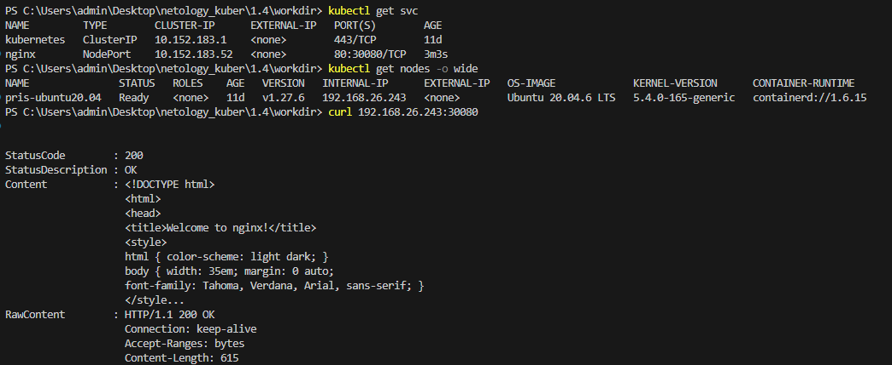

# Домашнее задание к занятию «Сетевое взаимодействие в K8S. Часть 1»

------

------

------

### Задание 1. Создать Deployment и обеспечить доступ к контейнерам приложения по разным портам из другого Pod внутри кластера

1. Создать Deployment приложения, состоящего из двух контейнеров (nginx и multitool), с количеством реплик 3 шт.

2. Создать Service, который обеспечит доступ внутри кластера до контейнеров приложения из п.1 по порту 9001 — nginx 80, по 9002 — multitool 8080.
3. Создать отдельный Pod с приложением multitool и убедиться с помощью `curl`, что из пода есть доступ до приложения из п.1 по разным портам в разные контейнеры.
4. Продемонстрировать доступ с помощью `curl` по доменному имени сервиса.

5. Предоставить манифесты Deployment и Service в решении, а также скриншоты или вывод команды п.4.

[a link](https://github.com/user/repo/blob/branch/other_file.md)

[a link](https://github.com/user/repo/blob/branch/other_file.md)

------

### Задание 2. Создать Service и обеспечить доступ к приложениям снаружи кластера

1. Создать отдельный Service приложения из Задания 1 с возможностью доступа снаружи кластера к nginx, используя тип NodePort.
2. Продемонстрировать доступ с помощью браузера или `curl` с локального компьютера.

3. Предоставить манифест и Service в решении, а также скриншоты или вывод команды п.2.

------

### Правила приёма работы

1. Домашняя работа оформляется в своем Git-репозитории в файле README.md. Выполненное домашнее задание пришлите ссылкой на .md-файл в вашем репозитории.
2. Файл README.md должен содержать скриншоты вывода необходимых команд `kubectl` и скриншоты результатов.
3. Репозиторий должен содержать тексты манифестов или ссылки на них в файле README.md.

