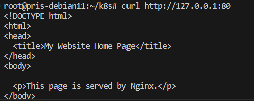

# Домашнее задание к занятию «Конфигурация приложений»

### Цель задания

В тестовой среде Kubernetes необходимо создать конфигурацию и продемонстрировать работу приложения.

------

### Чеклист готовности к домашнему заданию

1. Установленное K8s-решение (например, MicroK8s).
2. Установленный локальный kubectl.
3. Редактор YAML-файлов с подключённым GitHub-репозиторием.

------

### Инструменты и дополнительные материалы, которые пригодятся для выполнения задания

1. [Описание](https://kubernetes.io/docs/concepts/configuration/secret/) Secret.
2. [Описание](https://kubernetes.io/docs/concepts/configuration/configmap/) ConfigMap.
3. [Описание](https://github.com/wbitt/Network-MultiTool) Multitool.

------

### Задание 1. Создать Deployment приложения и решить возникшую проблему с помощью ConfigMap. Добавить веб-страницу

1. Создать Deployment приложения, состоящего из контейнеров nginx и multitool.

```
apiVersion: v1
kind: ConfigMap
metadata:
  name: mymap
data:
  port: "8080"

---

apiVersion: apps/v1
kind: Deployment
metadata:
  name: create-dir
spec:
  replicas: 1
  selector:
    matchLabels:
      app: dir
  template:
    metadata:
      labels:
        app: dir
    spec:
      containers:
      - image: nginx
        name: nginx

      - name: multitool
        image: wbitt/network-multitool
        env:
          - name: HTTP_PORT
            valueFrom:
              configMapKeyRef:
                name: mymap
                key: port
```

2. Решить возникшую проблему с помощью ConfigMap.
3. Продемонстрировать, что pod стартовал и оба конейнера работают.


4. Сделать простую веб-страницу и подключить её к Nginx с помощью ConfigMap. Подключить Service и показать вывод curl или в браузере.
```
kubectl port-forward --address 0.0.0.0 service/nginxservice  80:9001
```


5. Предоставить манифесты, а также скриншоты или вывод необходимых команд.


[task1.yaml](https://github.com/djohnii/netology_kuber/blob/main/2.3/workdir/task1.yaml)

------

### Задание 2. Создать приложение с вашей веб-страницей, доступной по HTTPS 

1. Создать Deployment приложения, состоящего из Nginx.
2. Создать собственную веб-страницу и подключить её как ConfigMap к приложению.
3. Выпустить самоподписной сертификат SSL. Создать Secret для использования сертификата.
```
openssl req -x509 -nodes -days 365 -newkey rsa:2048 -keyout server-key.pem -out server.pem -subj "/CN=example.com/0=example.com"

kubectl create secret tls tls-secret --key server-key.pem --cert server.pem
```

4. Создать Ingress и необходимый Service, подключить к нему SSL в вид. Продемонстировать доступ к приложению по HTTPS. 


5. Предоставить манифесты, а также скриншоты или вывод необходимых команд.

[task2.yaml](https://github.com/djohnii/netology_kuber/blob/main/2.3/workdir/task2.yaml)

------

### Правила приёма работы

1. Домашняя работа оформляется в своём GitHub-репозитории в файле README.md. Выполненное домашнее задание пришлите ссылкой на .md-файл в вашем репозитории.
2. Файл README.md должен содержать скриншоты вывода необходимых команд `kubectl`, а также скриншоты результатов.
3. Репозиторий должен содержать тексты манифестов или ссылки на них в файле README.md.

------
